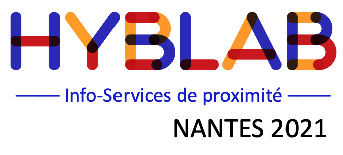

Source code of all the projects of [Hyblab 2021][2]. Hyblab 2021 is an interactive data-service project organized by [Ouest Medilab][3] in the city of Nantes (France) from January 14 to February 2, 2021.

Three schools participated in this project:

 - [SciencesCom][4] (journalism)
 - [Polytech Nantes][5] (computer science)
 - [AGR-L'école de l'image][6] (web design)

This year, all 10 projects where proposed by Ouest Médialab for his partner medias.

[2]: http://www.hyblab.fr
[3]: http://www.ouestmedialab.fr
[4]: http://www.sciencescom.org
[5]: http://www.polytech.univ-nantes.fr
[6]: http://www.agrnantes.fr

# How to run the code ?

- Download the code...
- Install a recent version of nodejs
- Type `npm install` at the root of the code folder
- Type `npm start` to launch a local server at 127.0.0.1 on port 8080
- You can now visit any project at http://127.0.0.1:8080/name_of_the_projet. For example: http://127.0.0.1:8080/simple-example